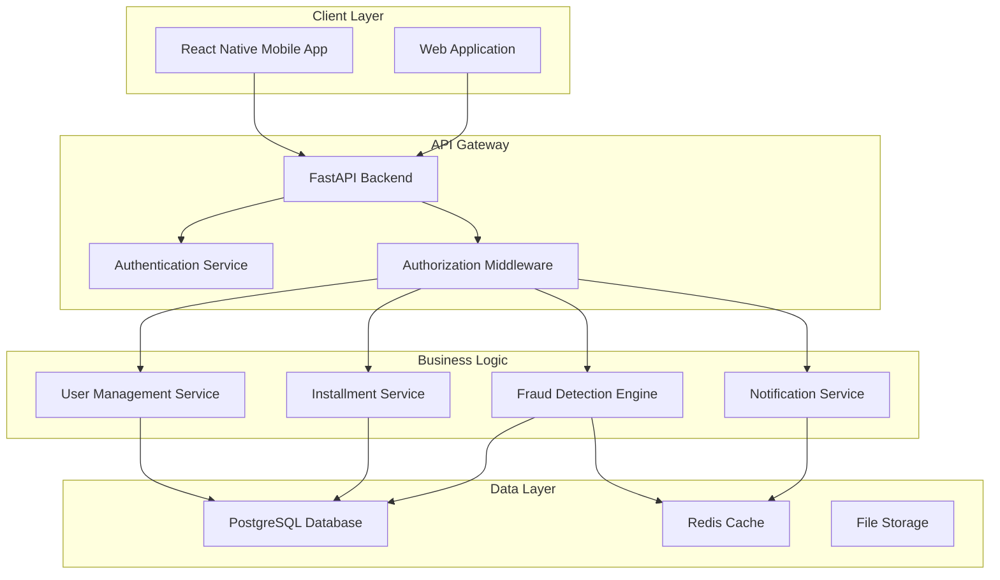
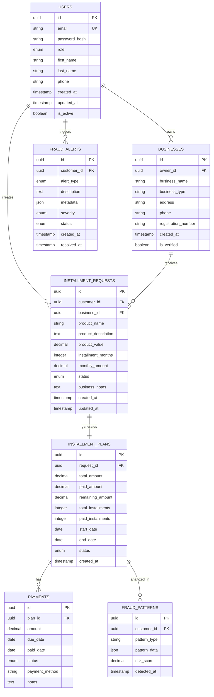

# Design Document

## Overview

The Installment Fraud Detection System is a comprehensive platform that tracks installment purchases across multiple businesses to detect and prevent fraudulent chains. The system uses a multi-tenant architecture with role-based access control, real-time fraud detection algorithms, and cross-business data sharing capabilities.

## Architecture

### System Architecture


### Database Architecture


## Components and Interfaces

### 1. Authentication & Authorization Component

**Purpose:** Handle user authentication and role-based access control

**Key Classes:**
- `AuthService`: Manages JWT token generation and validation
- `RoleMiddleware`: Enforces role-based permissions
- `UserRepository`: Database operations for user management

**Interfaces:**
```typescript
interface AuthService {
  login(email: string, password: string): Promise<AuthResponse>
  register(userData: UserRegistration): Promise<User>
  validateToken(token: string): Promise<User>
  refreshToken(refreshToken: string): Promise<AuthResponse>
}

interface AuthResponse {
  user: User
  accessToken: string
  refreshToken: string
  expiresIn: number
}
```

### 2. Installment Management Component

**Purpose:** Handle installment requests, approvals, and plan management

**Key Classes:**
- `InstallmentService`: Core business logic for installments
- `InstallmentRepository`: Database operations
- `PaymentScheduler`: Generate and manage payment schedules

**Interfaces:**
```typescript
interface InstallmentService {
  createRequest(request: InstallmentRequestData): Promise<InstallmentRequest>
  approveRequest(requestId: string, businessNotes?: string): Promise<InstallmentPlan>
  rejectRequest(requestId: string, reason: string): Promise<void>
  getCustomerHistory(customerId: string): Promise<InstallmentHistory[]>
  processPayment(planId: string, amount: number): Promise<Payment>
}
```

### 3. Fraud Detection Engine

**Purpose:** Analyze patterns and detect potential fraudulent activities

**Key Classes:**
- `FraudDetectionEngine`: Main fraud analysis logic
- `PatternAnalyzer`: Identify suspicious patterns
- `RiskCalculator`: Calculate customer risk scores
- `AlertManager`: Generate and manage fraud alerts

**Interfaces:**
```typescript
interface FraudDetectionEngine {
  analyzeCustomer(customerId: string): Promise<FraudAnalysis>
  detectPatterns(customerId: string): Promise<FraudPattern[]>
  calculateRiskScore(customerId: string): Promise<number>
  generateAlert(customerId: string, alertType: AlertType): Promise<FraudAlert>
}

interface FraudAnalysis {
  customerId: string
  riskScore: number
  activeInstallments: number
  totalDebt: number
  suspiciousPatterns: FraudPattern[]
  recommendations: string[]
}
```

### 4. Business Intelligence Component

**Purpose:** Provide analytics and reporting for superadmins

**Key Classes:**
- `AnalyticsService`: Generate reports and statistics
- `DashboardService`: Provide dashboard data
- `ReportGenerator`: Create detailed reports

**Interfaces:**
```typescript
interface AnalyticsService {
  getSystemStats(): Promise<SystemStatistics>
  getFraudTrends(timeRange: TimeRange): Promise<FraudTrends>
  getBusinessMetrics(businessId?: string): Promise<BusinessMetrics>
  generateFraudReport(customerId: string): Promise<FraudReport>
}
```

## Data Models

### Core Entities

**User Model:**
```typescript
interface User {
  id: string
  email: string
  role: UserRole
  firstName: string
  lastName: string
  phone: string
  createdAt: Date
  isActive: boolean
  business?: Business // Only for business users
}

enum UserRole {
  SUPERADMIN = 'superadmin',
  BUSINESS = 'business',
  CUSTOMER = 'customer'
}
```

**Installment Request Model:**
```typescript
interface InstallmentRequest {
  id: string
  customerId: string
  businessId: string
  productName: string
  productDescription: string
  productValue: number
  installmentMonths: number
  monthlyAmount: number
  status: RequestStatus
  businessNotes?: string
  createdAt: Date
  updatedAt: Date
}

enum RequestStatus {
  PENDING = 'pending',
  APPROVED = 'approved',
  REJECTED = 'rejected'
}
```

**Fraud Pattern Model:**
```typescript
interface FraudPattern {
  id: string
  customerId: string
  patternType: PatternType
  patternData: Record<string, any>
  riskScore: number
  detectedAt: Date
}

enum PatternType {
  RAPID_REQUESTS = 'rapid_requests',
  HIGH_DEBT_RATIO = 'high_debt_ratio',
  CROSS_BUSINESS_CHAIN = 'cross_business_chain',
  PAYMENT_DEFAULT_PATTERN = 'payment_default_pattern'
}
```

## Error Handling

### Error Categories
1. **Authentication Errors**: Invalid credentials, expired tokens
2. **Authorization Errors**: Insufficient permissions
3. **Business Logic Errors**: Invalid installment terms, duplicate requests
4. **Data Validation Errors**: Invalid input data
5. **System Errors**: Database connectivity, external service failures

### Error Response Format
```typescript
interface ErrorResponse {
  error: {
    code: string
    message: string
    details?: Record<string, any>
    timestamp: string
  }
}
```

### Error Handling Strategy
- Use custom exception classes for different error types
- Implement global error handler middleware
- Log all errors with appropriate severity levels
- Return user-friendly error messages
- Implement retry mechanisms for transient failures

## Testing Strategy

### Unit Testing
- Test individual components and services
- Mock external dependencies
- Achieve 90%+ code coverage
- Focus on business logic and edge cases

### Integration Testing
- Test API endpoints with real database
- Test fraud detection algorithms with sample data
- Verify role-based access control
- Test cross-business data sharing

### End-to-End Testing
- Test complete user workflows
- Verify mobile and web functionality
- Test fraud detection scenarios
- Performance testing under load

### Security Testing
- Authentication and authorization testing
- SQL injection and XSS prevention
- Data encryption verification
- API security testing

## Performance Considerations

### Database Optimization
- Index frequently queried columns
- Implement database connection pooling
- Use read replicas for analytics queries
- Implement data archiving for old records

### Caching Strategy
- Cache user sessions in Redis
- Cache frequently accessed business data
- Implement fraud pattern caching
- Use CDN for static assets

### Scalability
- Horizontal scaling for API servers
- Database sharding by business or region
- Asynchronous processing for fraud detection
- Load balancing for high availability

## Security Measures

### Data Protection
- Encrypt sensitive data at rest
- Use HTTPS for all communications
- Implement field-level encryption for PII
- Regular security audits and penetration testing

### Access Control
- JWT-based authentication
- Role-based authorization
- API rate limiting
- Session management and timeout

### Fraud Prevention
- Real-time monitoring and alerting
- Anomaly detection algorithms
- Machine learning for pattern recognition
- Integration with external fraud databases